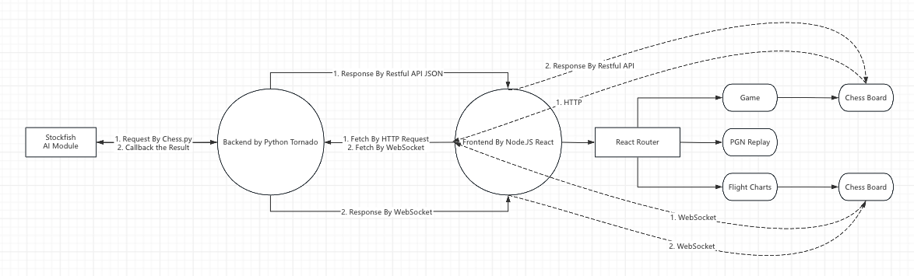
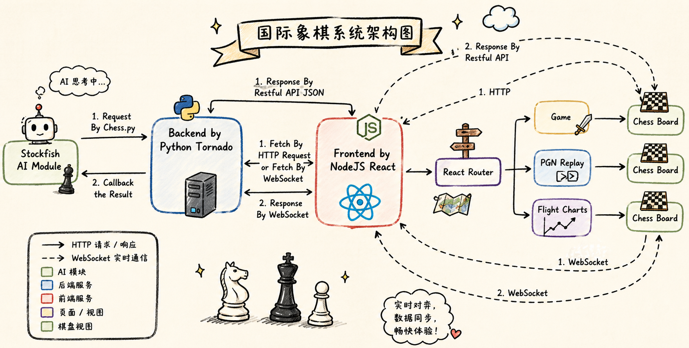
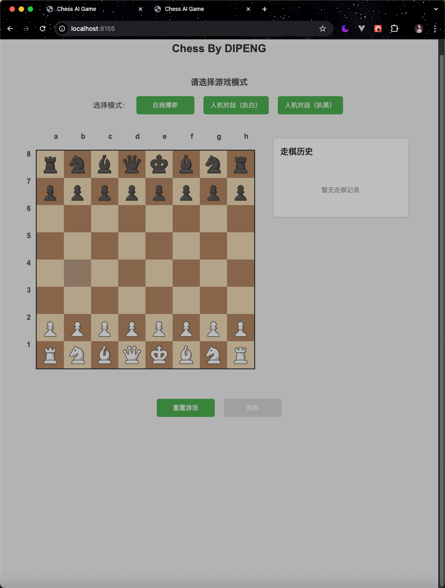
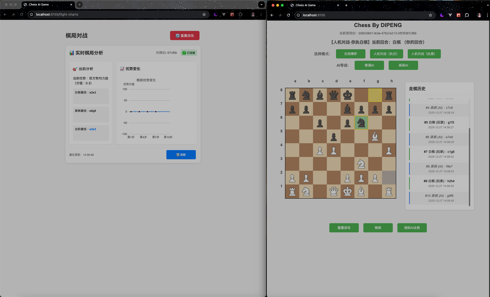
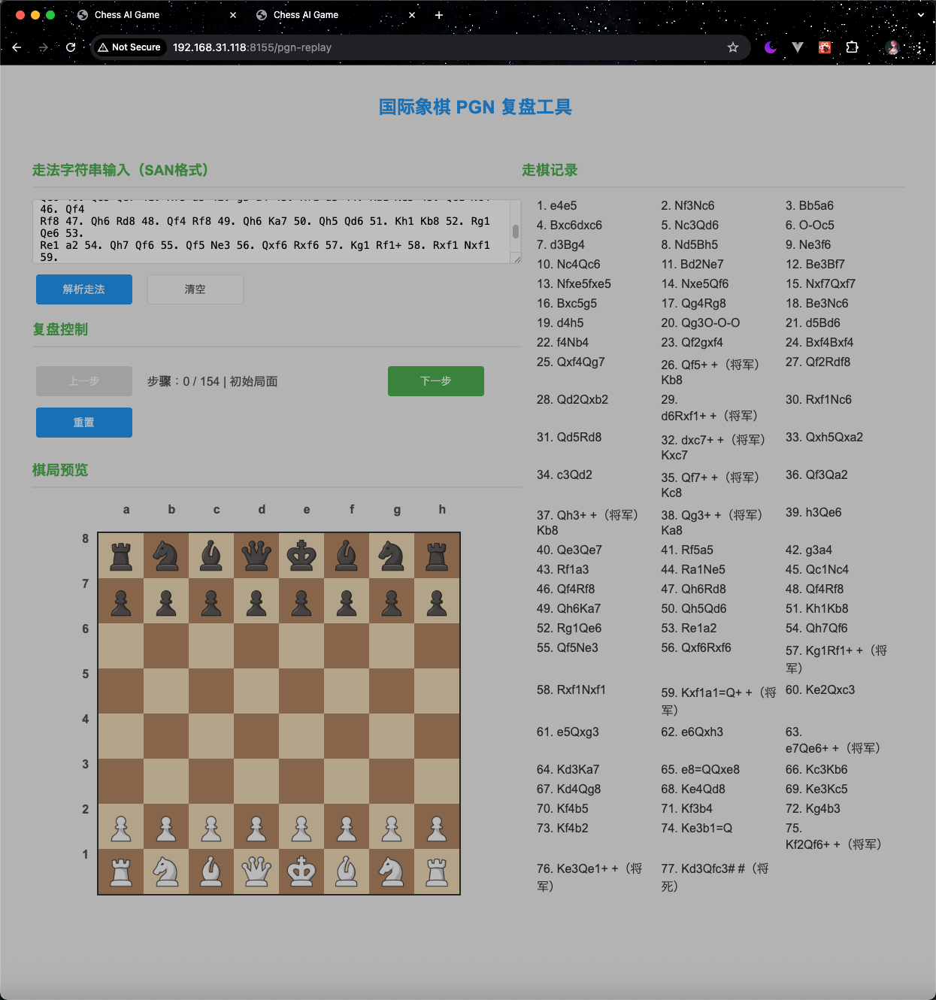

# Tech Scaffold
| Type      | Tech                                                 |
|-----------|------------------------------------------------------|
| AI Engine | [Stockfish](https://zh.wikipedia.org/wiki/Stockfish) |
| Frontend  | React.JS                                             |
| Backend   | Python Tornado                                       |

# Tech Architecture
- Drew by ProcessOn


- Drew by ChatGPT with ProcessOn Image


# Backend
Code by Python Tornado Web, most code is written by Codex with GPT-5.4 and Github Copilot. 

# Frontend
Code by React.js, most code is written by Codex with GPT-5.4 and Github Copilot. 

# Chess Engine
Supported By [Stockfish](https://stockfishchess.org/), a open-source engine.

Here is the [Download Page](https://stockfishchess.org/download/)

[In this case](./backend/config.py), I use the macOS, cause I use the macBook and mac-mini. 
```python
STOCKFISH_PATH = os.path.join(BASE_DIR, "stockfish/stockfish-macos-m1-apple-silicon")
```
Create a folder named 'stockfish' and take the stockfish engineer into this folder!

If you use Windows or Linux, you can visit the offical to download the suitable version and change it.

# SAMPLE IMAGE
- Chess Game


- Chess Flight Charts


- Chess PGN Replay


# How to start this Project?
- with the [npm file](./package.json), you can easily use the command `npm run start` if you have the node environment!

# More Details
You can review the [Page](https://dipengxu.life/toy/chess.html)